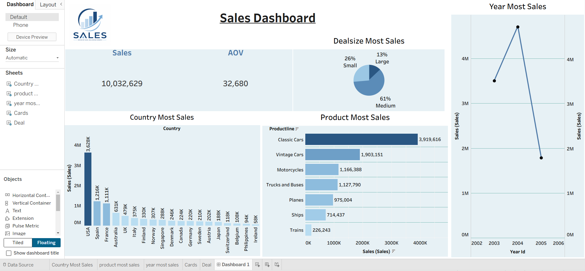

# Sales Analysis Dashboard

## 📊 Project Overview

An interactive sales analysis dashboard built using Tableau to analyze sales performance across different products, countries, years, and deal sizes.

The project transforms sales data into meaningful business insights through interactive visualizations and key performance indicators.

## 🛠️ Tools & Skills

- Tableau
- Data Analysis
- Data Visualization
- Dashboard Design
- Sales Analysis
- Business Insights

## 📈 Dashboard Features

- Total Sales
- Average Order Value (AOV)
- Sales by Country
- Sales by Product Line
- Sales by Year
- Sales by Deal Size

## 📁 Project Files

- `Dashboard.png` — Dashboard preview
- `Dashboard_Tableau.twb` — Tableau workbook
- `Sales_Tableau.xlsx` — Source dataset

## 🖼️ Dashboard Preview

